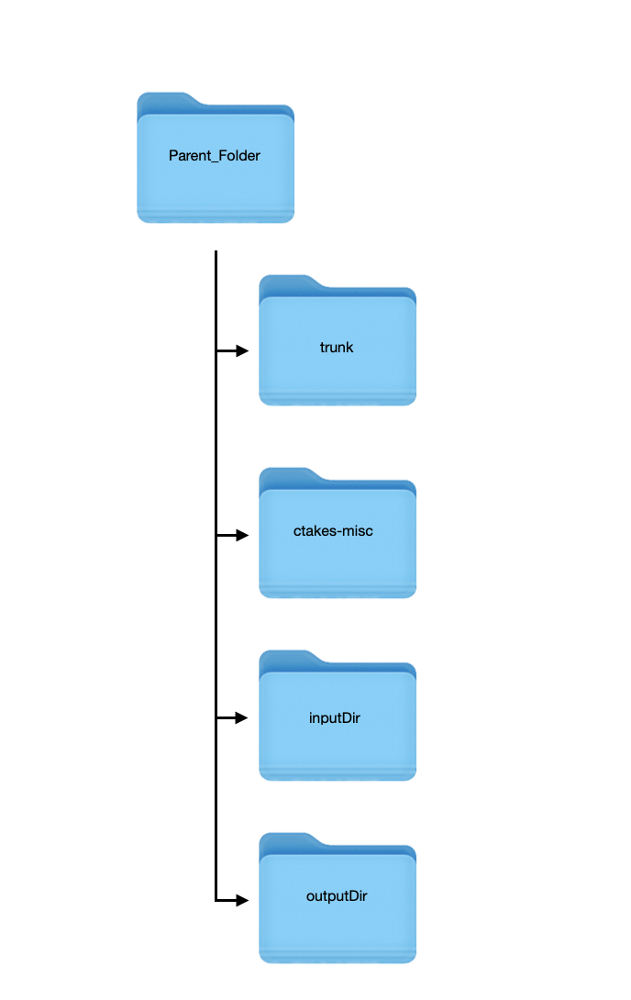

# README

Requirements for running cTAKES, note that CUI extraction (see below) has different requirements that depend on how it is run:

- cTAKES 4.0.0.1 installed
- custom NLM Library installed 
- python 3.6+ installed

## Initial Comments
cTAKES processing requires an NLM library. This can be either a local custom library, or the library online. In both cases, it is required that your workflow authenticates to the NLM, even if you are using a local library. If you need to run cTAKES in an environment that is completely isolated from the Internet, then contact Sean Finan on the cTAKES dev team for assistance.

There are several versions of cTAKES available. This workflow uses cTAKES 4.0.0.1, and it has not been tested against other versions.

In addition to cTAKES, you must have Java installed, and python 3.6+ installed. Although the documentation stated cTAKES is compatible with 
Java 1.8+, we found Java 15 worked the best.

# Custom cTAKES Dictionary Creation
1. Download dictionary from UMLS at https://www.nlm.nih.gov/research/umls/licensedcontent/umlsknowledgesources.html , note this requires authentication each time you download the file.
2. Unzip the `mmsys.zip` file, and copy the compressed contents **to the same directory where the \*.nlm files reside** (this is usually the parent directory)
3. Run the *run_mac.sh* file to launch MetamorphoSys on MacOSX, or the *run.bat* file on Windows.
4. Configure a custom dictionary following the prompts and the guide [here](https://www.nlm.nih.gov/research/umls/implementation_resources/metamorphosys/help.html). When selecting sources, note that this provides a selection of sources that can be used when creating a custom dictionary. For example, if you select RXNorm and SNOMEDCT_US as sources, then when creating the custom dictionary in step 5, you will have the option of using SNOMEDCT_US only, RXNorm only, or both RXNorm and SNOMEDCT_US in the custom dictionary.
5. Run *./bin/runDictionaryCreator.sh* to [create the custom dictionary](https://cwiki.apache.org/confluence/display/CTAKES/Dictionary+Creator+GUI)

### Notes and Comments for Dictionary Creation
1. Steps 1-4 above did not work on our lab servers running Centos 7. My speculation is there was a problem/conflict with X11, but it worked without problems on Mac OSX 10.15.7, Mac OSX 13.1, and Windows Server 2019, which all used an Intel x86_64 chipset. After completing steps 1-4 above on Windows or MacOSX, the configured UMLS installation can be copied to the appropriate computer if necessary to finish installation and setup of the Custom Dictionary in step 5 above.
2. If you do not follow step 2 above exactly, the MetamorphoSys App will not be able to locate the required UMLS files.
3. If you are not certain which subset to use (see image 1 below), then select "Level 0 + SNOMEDCT_US".
4. To start the configuration in step 4, you need to click the "Done" menu then click "Begin Subset" (see image2 below)

#### Image 1: Example subset selection

#### Image 2: Start configuration

# Preprocessing
First, run [parse_notes.py](code/parse_notes.py) to split the initial CSV file. Update the `NOTES_FILE=` variable with the correct file name, and update SPLIT_ID to contain a term that can be used to split the dataset into manageable sizes.

Then, run [parseEntries.cTAKES.Notes.getFileSizes.v3.py](code/parseEntries.cTAKES.Notes.getFileSizes.v3.py) to generate a file list with file sizes, and run [parseEntries.cTAKES.Notes.sortBySize.v3.py](code/parseEntries.cTAKES.Notes.sortBySize.v3.py) to sort the files by size.

It is very important for the input cTAKES file(s) to have a header and values for the DocumentID, the Patient ID, the Encounter ID, the Document Type, and a Timestamp. Note that at a minimum, the file(s) must have a unique value for the Patient ID and the Encounter ID. See the postprocessing section for more information about this.

# Run cTAKES
cTAKES is atomic, and by itself cannot be parallelized. However, it is possible to start multiple instances of cTAKES processing. An example of single file processing is in the [run_ctakes.singleFile.sh](code/run_ctakes.singleFile.sh) bash script, and the parallel_example is in the script [parallel_example.sh](code/parallel_example.sh), which takes as input a list of files to process, and outputs this list to an designated output directory.

First, run [setup_cTAKES.sh](code/setup_cTAKES.sh) to create cTAKES instances, and update the [parallel_example.sh](code/parallel_example.sh) file to contain the correct input, output, and the correct number of cTAKES instances that match your system needs. Do not start more than `n/2` instances of cTAKES, where `n` is the total number of CPU cores available. 

Within either bash script, the runPiperFile.mod.sh is a modified script that points to the correct Java, a modified piper file, and a custom dictionary. Another option is to simply use the default dictionary.

It is **strongly** recommended to use the [gzipFiles.sh](/code/gzipFiles.sh) script (or write a custom one) to compress output XMI files, both because the subsequent step assumes the input will be gzip-compressed, and because XMI files can take up exponentially more storage space than their input file counterparts.

## Additional General Notes
* It is **strongly** recommended to use the [gzipFiles.sh](/code/gzipFiles.sh) script (or write a custom one) to compress output XMI files, both because the subsequent step assumes the input will be gzip-compressed, and because XMI files can take up exponentially more storage space than their input file counterparts.
* Following the preprocessing steps listed above, the medical notes were ready for the processing and analysis steps in the cTAKES overview. There is an exponential increase in processing time versus file size, so it is very important to split input files by size.
* The [preprocessing](code/preprocessing) directory contains code that was used to perform additional preprocessing on notes, and is provided as a code template for additional work that may be necessary.

# Postprocessing Steps

There are three components to postprocessing, and generating an output flatfile with the format:

    FileID||NoteType||PatientID||EncounterID||TimeStamp||CUI||PreferredText||OffsetStart||OffsetStop||DomainCode||Polarity

The first two steps (CUI extraction and Data Extraction) can be run in any order, but the output from both are required to run the third (final) step, which generates a text `||`-delimited output flat file.

For information on visualizing CUIs, including tracking exactly what spans of text were mapped to a given CUI, skip to the section on [visualizing CUIs](https://git.doit.wisc.edu/smph-public/dom/uw-icu-data-science-lab-public/ctakes_processing/-/blob/main/README.md#visualizing-cuis).

## Step 1: CUI Extraction
This step uses java to extract the CUIs within the cTAKES XMI output files, while maintaining the correct ordering and CUI counts. The protocol has been extensively tested, but please note that the steps must be followed **exactly**. 

There are two ways to run this step: using Docker, or via manual installation. Both require the most recent Java to run (tested with Java 19).

### Docker Image

**IMPORTANT:** The underlying OS (Centos7) in the docker image [is official EOL](https://www.centos.org/centos-linux-eol/). This OS version has known and unpatched security vulnerabilities, so it is extremely important to run the docker container in a controlled development environment.

First, download the Docker image from Dockerhub.

    docker pull datacram/c7cuiextractor:v1-2

Then, create a docker container with an attached volume to copy files to and from the Docker container 

    # assumes you want to create a docker container 
    # with the directory data_vol as the attached volume
    # that has an interactive shell
    # NOTE: the attached volume *must* be mounted at /dataspace or the workflow will not function!
    docker run -it -v data_vol:/dataspace datacram/c7cuiextractor:v1-2

Next, decompress and copy the XMI files, and the bash script [runCUIextractor.sh](https://git.doit.wisc.edu/smph-public/dom/uw-icu-data-science-lab-public/ctakes_processing/-/blob/update1/code/runCUIextractor.sh) to the `data_vol` folder in the example above. There are several ways to do this, below is one example:

    # run from Terminal on host
    for i in xmiDir/*.gz ; do gunzip $i ; DONE
    cp xmiDir/*.xmi datavol/inputDir/
    # run from docker container, XMI files must be copied to `/workspace/inputDir` folder
    cp inputDir/* /workspace/inputDir/

Finally, run the bash script from the Docker Container to process the files, where `INPUT_DIRECTORY` and `OUTPUT_DIRECTORY` are the input directory you copied with the cTAKES XMI files, 

    # from docker container
    ./runCUIextractor.sh INPUT_DIRECTORY OUTPUT_DIRECTORY

When complete, the CUI output files will be in the `/workspace/outputDir` folder.
    
### Manual Installation
A few notes before beginning are:
* The installation instructions and workflow have been fully tested on Centos7 Linux, but they should work on all Linux distros.
* The installation instructions must be followed **exactly**, especially with regards to software versions. For example, we found that the cTAKES workflow tended to work best with Java 15, compiling the base cTAKES package required Java 1.8, but the CUI extraction portion of the workflow should use the latest Java (tested with Java 19). 
* The installation and setup may take up to 2 hours, but only needs to be performed once. 
* The resulting installation directory can then be copied to other locations, however, `maven` will still look to the original user folder when running, meaning if you copy the directory to a run node and the ~/.m2 directory changes or cannot be found, the workflow will not function correctly.
* Most versions of the [Java 8 JDK are EOL](https://www.oracle.com/java/technologies/javase/javase8-archive-downloads.html), and will not have security or other updates. It is **extremely important** to run the Java portion of the workflow in a controlled development environment.

#### Setup Steps
1. Download and install Java 1.8, then ensure that this is the default Java version.
2. Download and install [maven](https://maven.apache.org/install.html), and ensure that maven is pointed to Java 1.8
3. Download cTAKES using SVN via `svn co https://svn.apache.org/repos/asf/ctakes/trunk/` (do not use the GitHub version!).
4. Change to the `trunk` directory, then run `mvn clean compile` (this will take up to an hour).
5. In the `trunk` directory, run `mvn install -Dmaven.test.skip=true` (this will take up to 45 minutes).
6. Change to the parent directory of `trunk`, then download the CUI extractor java code via `git clone https://github.com/disulfidebond/ctakes-misc.git`
7. If not done so already, [download and install Java 19](https://www.oracle.com/java/technologies/downloads/#java19). Ensure that maven is now pointed to this Java version.
7. Change to the `ctakes-misc` directory, then run `mvn clean compile` (this will take up to 15 minutes).
8. Create a directory named `inputDir` in the parent directory of `ctakes-misc`, then create a directory named `outputDir` in the parent directory of `ctakes-misc` (See Overview Figure below).
9. **After** completing step 8, unset `$JAVA_HOME` and `$CTAKES_HOME` variables. Then, from the `ctakes-misc` directory, use the following command to extract CUIs, where `/path/to/inputDir` is the full (absolute) path to the input directory created in Step 8, and `/path/to/outputDir` is the full (absolute) path to the output directory created in Step 8. Be sure to include trailing slash `/` characters.

        mvn exec:java -Dexec.mainClass="org.apache.ctakes.consumers.ExtractCuiSequences" -Dexec.args="--xmi-dir /path/to/inputDir/ --output-dir /path/to/outputDir/"

#### Overview Figure

### Additional Notes and Comments for CUI extraction
* Be sure to add `mvn` to your $PATH if doing the Manual Installation
* The output will be a CSV file of CUIs with the same root file name as the input file and ending with `.cuis.txt`
* It is possible to parallelize the CUI extraction workflow similar to cTAKES, but this has not been done yet with this version.

## Step 2: Data Extraction
This workflow takes as input either a directory of cTAKES output XMI files, or the input medical notes files. It uses the python script [note_data_extractor.py](https://git.doit.wisc.edu/smph-public/dom/uw-icu-data-science-lab-public/ctakes_processing/-/blob/update1/code/note_data_extractor.py) to extract the Document ID, Note Type, Patient ID, Encounter ID, and Note Timestamp. The required input arguments are:

* parseMode -> enter either `csv` for a medical note file, or `xmi` for an output cTAKES file. (Required)
* headerFile -> this must be a text file with the 0-based column indexes for the data columns you wish to extract. It must have values for `FileName`, `DocType`, `PatID`, `EncID`, and `TS`, which are the file name, document type, patient identifier, encounter identifier, and time stamp, respectively. An example is [here](https://git.doit.wisc.edu/smph-public/dom/uw-icu-data-science-lab-public/ctakes_processing/-/blob/update1/code/example_header_file.txt), see also the Important Notes for Data Extraction subsection below. (Required)
* debugMode -> set this to `verbose` to provide verbose output on file processing, and to disable deleting the temporary work directory at the conclusion of the workflow. The default is `quiet`.
* exitOnError -> if set to True, then the workflow will exit if it encounters a parsing error. The default is False.
* forceImport -> bypasses file checking and only attempts to import files using the provided method. The default is False.
* inputDirectory -> the input directory name where either **gz-compressed** XMI files are located, or uncompressed medical note files are located. (Required)
* outputFile -> the name for the output CSV file. (Required)
* previewMode -> if set to 'True', then the workflow will parse the first note file, print the output to the screen, and then exit without creating an output file. The default is False.

### Important Notes for Data Extraction
* The script will accept either XMI or a medical note (CSV) file, but you can only provide one set of headers. Meaning, the header indexes for both the medical note files and XMI files must be the same, or you'll need to run the data extractor multiple times.
* The script will automatically check the provided input files to see if they can be parsed as an XMI file, and if they can be imported as a CSV file into pandas. Although not advised, you can disable this functionality via `forceImport='True'` which will then bypass checking the files.
* All of the required fields for the headerFile must be provided. If one needs to be skipped (for example, if EncounterID == PatientID), then you enter "-1" for that field, which is shown in the [example](https://git.doit.wisc.edu/smph-public/dom/uw-icu-data-science-lab-public/ctakes_processing/-/blob/update1/code/example_header_file.txt).
* The workflow will not check to see if a file name with the same name as the provided outputFile exists before overwriting it.

## Step 3: Generate Final Output Flatfile
The python script [generate_flatfile](https://git.doit.wisc.edu/smph-public/dom/uw-icu-data-science-lab-public/ctakes_processing/-/blob/main/code/generate_flatfile.py) takes as input the CSV file from Data Extraction, and the output directory from CUI extraction. The usage is fairly straightforward:

* inputCSV -> the CSV file from Data Extraction
* inputDir -> the output directory of extracted CUIs
* outputFileName -> the output file name (the script will not check to see if a file with the same name exists before overwriting it!)

A few important caveats are:
1. All root filenames must be unique, e.g. if the file `E00001.txt` exists, then if the file `E00001.txt.xmi.gz` exists, it must be for the same medical note.
2. The Document ID will be the same for both the Data Extractor and CUI Extractor, e.g. the medical note with document identifier E00001.txt will have the XMI output file E00001.txt.xmi.gz, meaning the Document ID in both outputs will be E00001
2. Medical note filenames must have the format `Identifier.txt`, and additional periods cannot be used, but other characters can be used, e.g. `E00001_1.txt` is valid, but `E00001.1.txt` will cause errors.

## Visualizing CUIs
cTAKES has a builtin tool to visualize CUIs in the source document, called the CAS Visualization Debugger (CVD), which includes information on how cTAKES predicted a given span of text should map to a given CUI.

Important: The steps below can be run using only the downloaded cTAKES package.

First, ensure your computing environment is setup to run cTAKES as described above (for example, be certain `$JAVA_HOME` points to your Java 1.8 installation).

Next, run the following commands to copy the necessary files to the root level of the cTAKES directory:

    # assumes ctakes directory is called ctakes_4.0.0.1
    cd ctakes_4.0.0.1
    cp resources/org/apache/ctakes/typesystem/types/TypeSystem.xml ./
    # if using the provided examples, run the next two steps, otherwise copy the output XMI files to the ctakes_4.0.0.1 directory
    cp resources/org/apache/ctakes/examples/notes/*.txt inputDir/
    ./runCtakes.sh
    # then, start cTAKES CVD tool
    ./bin/runctakesCVD.mod.sh

The CVD Tool will then open. Before loading an XMI file, you must load a TypeSystem file to provide context:

##### Select Load TypeSystem

##### Locate Typesystem.xml file

Once the TypeSystem.xml file is loaded, you can load the output XMI file. Below are instructions that assume the output will be in the `cTAKES_4.0.0.1/outputDir` directory:

##### Locate output cTAKES XMI file

The note text should appear in the right pane. If it does not, then double check the XMI file and ensure it was generated without any errors.

To select the relevant region of the XMI file to view, you need to select

    AnnotationIndex
      -> uima.tcas.Annotation
        -> org.apache.ctakes.typesystem.type.textsem.IdentifiedAnnotation

This will show all of the CUIs. The ones of interest are usually `EntityMention` and `EventMention`

##### CVD Full View

##### CVD Zoomed-in View of Analysis Results Window Pane

Click the first entry in `EntityMention`. This will highlight the `Medical` term in the Note text. If you click the `0-` icon to the left, you'll see additional metadata, such as `begin`, `end`, and `ontologyConceptArr`. Click the `0-` icon next to `ontologyConceptArr`, and you'll see one entry at index 0 that was found by cTAKES (Note: if you click on another nested term, the highlighted text will fade, this is normal). Click the `0-` icon next to `org.apache.ctakes.typesystem.type.refsem.UmlsConcept`, and you'll see information like the `codingScheme` and the `cui` C0206476.

Note that sometimes cTAKES will generate multiple CUIs per segment of text. The behavior in the postprocessing workflow is to export all unique CUIs that are detected, meaning if cTAKES outputs the same CUI twice **for a given segmant of text**, then only one CUI will be returned, but if it reports two different CUIs, then both will be returned.

For an example of this, select the 12th indexed item for `EntityMention`, then follow the same steps above to see what CUIs cTAKES predicted were present. 

For the term "General", it predicted the CUI C4521767 and the CUI C0205246.

To exit CVD, either click the X in the upper right corner, or press control-c in the Terminal window that launched CVD.

### Tie-in
To see the CUI in the XMI file as an XML tag, open Terminal and navigate to the directory where the XMI is, you need to run the `simple_xmi_viewer` bash script. This breaks apart the XMI file into something that is close to human readable. However, running the script by itself will output the entire XMI file to the screen, so you need to setup a filter. To do this, run the following command to view the CUI C4521767 in the cTAKES output file:

    ./simple_xmi_viewer | grep 'cui' | grep C0205246

The output should look like this (assuming you used the file `dr_nutritious_1.txt.xmi`):

