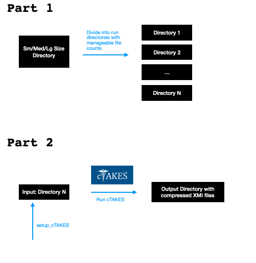
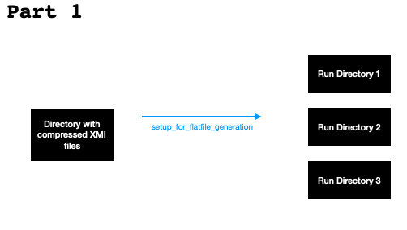
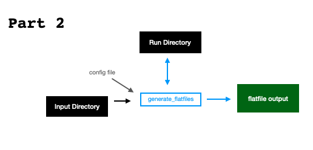

# README
Requirements:

- cTAKES 4.0.0.1 installed
- custom NLM Library installed 
- python 3.6+ installed

## Initial Comments
cTAKES processing requires an NLM library. This can be either a local custom library, or the library online. In both cases, it is required that your workflow authenticates to the NLM, even if you are using a local library. If you need to run cTAKES in an environment that is completely isolated from the Internet, then contact Sean Finan on the cTAKES dev team for assistance.

There are several versions of cTAKES available. This workflow uses cTAKES 4.0.0.1, and it has not been tested against other versions.

In addition to cTAKES, you must have Java installed, and python 3.6+ installed. Although the documentation stated cTAKES is compatible with 
Java 1.8+, we found Java 15 worked the best.

# Preprocessing
First, run [parse_notes.py](code/parse_notes.py) to split the initial CSV file. Update the `NOTES_FILE=` variable with the correct file name, and update SPLIT_ID to contain a term that can be used to split the dataset into manageable sizes.

Then, run [parseEntries.cTAKES.Notes.getFileSizes.v3.py](code/parseEntries.cTAKES.Notes.getFileSizes.v3.py) to generate a file list with file sizes, and run [parseEntries.cTAKES.Notes.sortBySize.v3.py](code/parseEntries.cTAKES.Notes.sortBySize.v3.py) to sort the files by size.

It is very important for the input cTAKES file(s) to have a header and values for the DocumentID, the Patient ID, the Encounter ID, the Document Type, and a Timestamp. Note that at a minimum, the file(s) must have a unique value for the Patient ID and the Encounter ID. See the postprocessing section for more information about this.

# Run cTAKES
cTAKES is atomic, and by itself cannot be parallelized. However, it is possible to start multiple instances of cTAKES processing. An example of single file processing is in the [run_ctakes.singleFile.sh](code/run_ctakes.singleFile.sh) bash script, and the parallel_example is in the script [parallel_example.sh](code/parallel_example.sh), which takes as input a list of files to process, and outputs this list to an designated output directory.

First, run [setup_cTAKES.sh](code/setup_cTAKES.sh) to create cTAKES instances, and update the [parallel_example.sh](code/parallel_example.sh) file to contain the correct input, output, and the correct number of cTAKES instances that match your system needs. Do not start more than `n/2` instances of cTAKES, where `n` is the total number of CPU cores available. 

Within either bash script, the runPiperFile.mod.sh is a modified script that points to the correct Java, a modified piper file, and a custom dictionary. Another option is to simply use the default dictionary.

It is **strongly** recommended to use the [gzipFiles.sh](/code/gzipFiles.sh) script (or write a custom one) to compress output XMI files, both because the subsequent step assumes the input will be gzip-compressed, and because XMI files can take up exponentially more storage space than their input file counterparts.

# Postprocessing
When completed, run `setup_for_flatfile_generation.py` to create a directory structure for flatfile processing and to create the required input files for flatfile processing. This script will create three target work directories, which will be used to decompress the compressed XMI files while they are being processed, and the output directories will be used to Finally, run `generate_flatfiles.v2_2d.py` to generate flatfiles from the compressed XMI files. This script will convert the XMI output to `||`-delimited text flatfiles. The output flatfiles can be over 50 GB in size, so it may be advisable to compress these files or directories.

Be sure to create a text config file with parameters for FileName, DocType (Document Type), PatID (Patient ID), EncID (Encounter ID), and TS (Timestamp). The config file is specified with the `--headerIdx` parameter, and points the flatfile generator to the corresponding comma separated field from the input text file. For example, if an input text file for cTAKES starts with the header and text:

    DocID,PatientID,EncounterID,DocumentType,TimeStamp,Text
    10001,P00001,E00001,PatientAssessment,01-02-2002,Assessment and Plan: Patient is a 34 y/o male with...

Then you'd create a config file that looks like this (note that the Document ID field maps to index 7, not index 1, because the first header field is index 1):

    FileName,7
    DocType,10
    PatID,8
    EncID,9
    TS,11

Important: You must use the exact identifier names listed above (e.g. `PatID`) in your config file!

# Additional Notes
* It is **strongly** recommended to use the [gzipFiles.sh](/code/gzipFiles.sh) script (or write a custom one) to compress output XMI files, both because the subsequent step assumes the input will be gzip-compressed, and because XMI files can take up exponentially more storage space than their input file counterparts.
* Following the preprocessing steps listed above, the medical notes were ready for the processing and analysis steps in the cTAKES overview. There is an exponential increase in processing time versus file size, so it is very important to split input files by size.
* The [preprocessing](code/preprocessing) directory contains code that was used to perform additional preprocessing on notes, and is provided as a code template for additional work that may be necessary.
* You may need to modify the `dictFromXMLTags()` function, and the `customDictKeys` hash in the main function of the `generate_flatfiles.v2_2d.py` python script.
