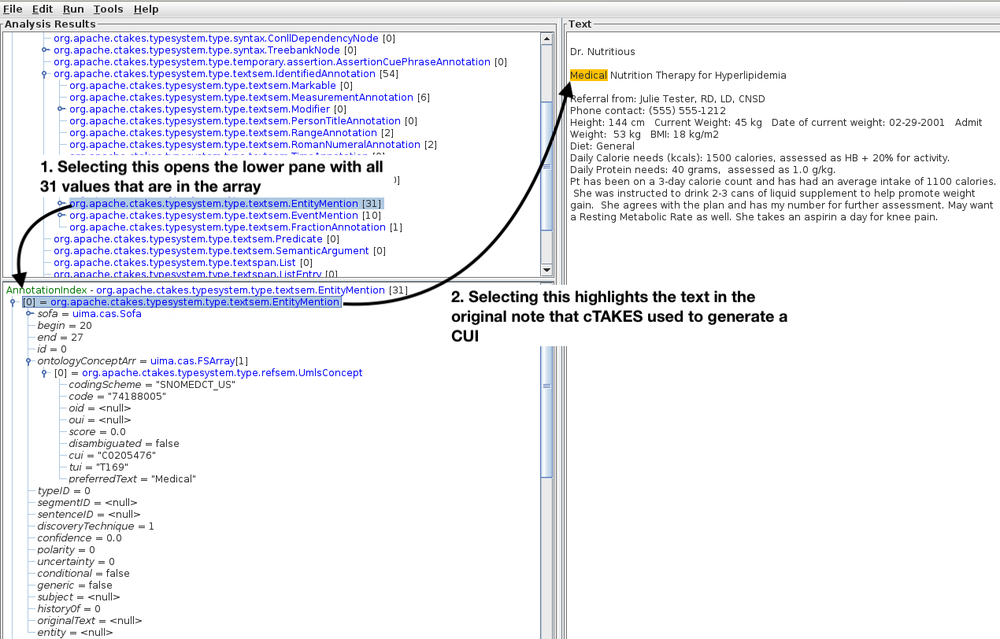

# README

Steps for generating flatfile output from clinical notes:
1. [Create custom dictionary using the SNOMEDCT_US vocabulary](https://git.doit.wisc.edu/smph-public/dom/uw-icu-data-science-lab-public/ctakes_processing/-/blob/main/README.md#custom-ctakes-dictionary-creation)
2. [Preprocess notes](https://git.doit.wisc.edu/smph-public/dom/uw-icu-data-science-lab-public/ctakes_processing/-/blob/main/README.md#preprocess-notes) to fit cTAKES requirements 
3. [Run cTAKES](https://git.doit.wisc.edu/smph-public/dom/uw-icu-data-science-lab-public/ctakes_processing/-/blob/main/README.md#run-ctakes)
4. [Postprocess notes](https://git.doit.wisc.edu/smph-public/dom/uw-icu-data-science-lab-public/ctakes_processing/-/blob/main/README.md#postprocess-notes) to convert XMI output to flat text file. If you want to see how to visualize the cTAKES XMI output, skip to [this section](https://git.doit.wisc.edu/smph-public/dom/uw-icu-data-science-lab-public/ctakes_processing/-/blob/main/README.md#visualizing-cuis)
5. [Frequently Asked Questions (FAQ)](https://git.doit.wisc.edu/smph-public/dom/uw-icu-data-science-lab-public/ctakes_processing/-/blob/main/README.md#faq)

To run the steps above, you will need:
- cTAKES 4.0.0.1 or higher downloaded and installed
- python 3.6+ installed
- Java 1.8 or higher
- An API key with the UMLS Terminology Services (this is free but requires an [account](https://uts.nlm.nih.gov/uts/login))

The most recent version of cTAKES is cTAKES 5.0, which is the recommended version. To use cTAKES version 5.0, you will need to [clone the Git Repository](https://github.com/apache/ctakes), then use Maven in an IDE such as IntelliJ IDEA to build, compile, and then create the required java jar files. A full description of building and compiling cTAKES 5.0 is beyond the scope of this writeup, but a summary description of the steps to install cTAKES 5.0 is available as an [appendix](https://git.doit.wisc.edu/smph-public/dom/uw-icu-data-science-lab-public/ctakes_processing/-/blob/main/README.md#appendix-installing-ctakes-50).

Alternatively, you can use the User Installation of cTAKES 4.0.0.1, which is available for download [here](https://ctakes.apache.org), and has installation instructions [here](https://cwiki.apache.org/confluence/display/CTAKES/cTAKES+4.0+User+Install+Guide). 

The documentation here provides instructions for how to modify your workflow if you are using cTAKES 5.0 or cTAKES 4.0.0.1, but generally speaking, the steps and code are compatible with both versions.

Running cTAKES requires a custom dictionary to be built ahead of time and copied into your cTAKES installtion, and it is required that your workflow authenticates to the NLM when cTAKES starts. If you need to run cTAKES in an environment that is completely isolated from the Internet, then contact Sean Finan on the cTAKES dev team for assistance.

Unless you are building/compiling cTAKES 5.0, we found that using the Java 15 SDK worked the best when running cTAKES, but YMMV.

# Custom cTAKES Dictionary Creation
1. Download dictionary from UMLS at https://www.nlm.nih.gov/research/umls/licensedcontent/umlsknowledgesources.html , note this requires authentication each time you download the file.
2. Unzip the `mmsys.zip` file, and copy the compressed contents **to the same directory where the \*.nlm files reside** (this is usually the parent directory)
3. Run the *run_mac.sh* file to launch MetamorphoSys on MacOSX, or the *run.bat* file on Windows.
4. Configure a custom dictionary following the prompts and the guide [here](https://www.nlm.nih.gov/research/umls/implementation_resources/metamorphosys/help.html). When selecting sources (see Select Default Subset image below), note that this provides a selection of sources that can be used when creating a custom dictionary. For example, if you select RXNorm and SNOMEDCT_US as sources, then when creating the custom dictionary in step 6, you will have the option of using SNOMEDCT_US only, RXNorm only, or both RXNorm and SNOMEDCT_US in the custom dictionary.

###### Default Subset

5. When finished with step 4, select "Begin Subset" (see Start Configuration image below)

###### Start Configuration

6. Run *./bin/runDictionaryCreator.sh* to [create the custom dictionary](https://cwiki.apache.org/confluence/display/CTAKES/Dictionary+Creator+GUI).

###### runDictionaryCreator

Images for generating a custom dictionary using cTAKES 4.0.0.1 and cTAKES 5.0 are both shown below. 

###### cTAKES 4.0.0.1 Build Dictionary

###### cTAKES 5.0 Build Dictionary

Critically, be certain that only SNOMEDCT_US is selected, and nothing is changed in the rightmost pane.

7. Next, within the cTAKES installation, you need to update the XML properties file to hold your username and API key. This is usually at `resources/org/apache/ctakes/dictionary/lookup/fast/`

###### Modify the XML Properties File snomedonly.xml

8. Finally, modify the Piper file at `resources/org/apache/ctakes/clinical/pipeline/DefaultFastPipeline.piper` and the bash runFile `runCTAKES.sh` to point both to the custom dictionary.

###### If you are running cTAKES 4.0.0.1, ensure the piper file DefaultFastPipeline.piper looks like this:

###### If you are running cTAKES 5.0, ensure the piper file DefaultFastPipeline.piper looks like this:

###### update [runCTAKES.sh](https://git.doit.wisc.edu/smph-public/dom/uw-icu-data-science-lab-public/ctakes_processing/-/blob/main/code/runCTAKES.sh) script that you cloned with this repo to replace CUSTOMNAME with the name of the custom dictionary you just created

    # code
    ./bin/runPiperFile.sh -p resources/org/apache/ctakes/clinical/pipeline/DefaultFastPipeline.piper -l resources/org/apache/ctakes/dictionary/lookup/fast/CUSTOMNAME.xml -i inputDir --xmiOut outputDir &>> ctakes_${TSTRING}_log.txt

### General Notes and Comments for Dictionary Creation
* Steps 1-4 above did not work on our lab servers running Centos 7 Linux. My speculation is there was a problem/conflict with X11, but the steps worked without problems on Mac OSX 10.15.7, Mac OSX 13.1, and Windows Server 2019, which all used an Intel x86_64 chipset. After completing steps 1-4 above on Windows or MacOSX, the configured UMLS installation can be copied to the appropriate computer if necessary to finish installation and setup of the Custom Dictionary in step 6 above.
* If you do not follow step 2 above exactly, the MetamorphoSys App will not be able to locate the required UMLS files.
* If you are not certain which subset to use, [then select](https://git.doit.wisc.edu/smph-public/dom/uw-icu-data-science-lab-public/ctakes_processing/-/blob/main/README.md#default-subset) "Level 0 + SNOMEDCT_US". In Step 6, you will select only the SNOMEDCT_US vocabulary to use in the final custom dictionary that cTAKES will use.
* To start the configuration in [step 5](https://git.doit.wisc.edu/smph-public/dom/uw-icu-data-science-lab-public/ctakes_processing/-/blob/main/README.md#start-configuration), you need to click the "Done" menu then select "Begin Subset".

# Preprocess Notes
* First, run [parse_notes.py](code/parse_notes.py) to split the initial CSV file. Update the `NOTES_FILE=` variable with the correct file name, and update SPLIT_ID to contain a term that can be used to split the dataset into manageable sizes.

* Then, run [parseEntries.cTAKES.Notes.getFileSizes.v3.py](code/parseEntries.cTAKES.Notes.getFileSizes.v3.py) to generate a file list with file sizes, and run [parseEntries.cTAKES.Notes.sortBySize.v3.py](code/parseEntries.cTAKES.Notes.sortBySize.v3.py) to sort the files by size. You may wish to clip the header from each note file to ensure cTAKES does not assign CUIs from the headers. 

* The [preprocessing](code/preprocessing) directory contains code that was used to perform additional preprocessing on notes, and is provided as a code template for additional work that may be necessary.

# Run cTAKES
cTAKES is atomic, and by itself cannot be parallelized. However, it is possible to start multiple instances of cTAKES processing. 

A [parallel processing python script](https://git.doit.wisc.edu/smph-public/dom/uw-icu-data-science-lab-public/ctakes_processing/-/blob/main/code/parallel_process_cTAKES.py) that uses the Multiprocessing library does this for you. It requires as arguments:

* `-i` for the name of the input directory of notes files
* `-t` for the name of the cTAKES installation directory that will be copied to each worker

Optional input arguments are:
* `--splitCount` for the number of files to process per instance [5000]
* `--instanceLimit` for the number of parallel workers to start [10]

The output will be directories with the naming scheme `runInstance_x_INT` where x is the name of the cTAKES installation directory provided with the `-t` argument, and `INT` is an integer starting at 0. Each output directory from each worker will have log files and an `outputDir` directory containing gz-compressed XMI files.

If a worker encounters an error with cTAKES, it stops, creates a tar-gz of the input and output directories, and then proceeds to the next batch of input files.

The code for running cTAKES can be used with cTAKES 4.0.0.1 and cTAKES 5.0 interchangeably, but be certain the piper file is formatted correctly.

For more information on this and using the XML cleaners, see the [FAQ](https://git.doit.wisc.edu/smph-public/dom/uw-icu-data-science-lab-public/ctakes_processing/-/blob/main/README.md#faq).

After all cTAKES processing has completed, you can copy the compressed XMI output files from each directory with a command similar to:

    for i in ctakes_runInstance_* ; do
      cp ${i}/outputDir/* someDestinationFolder/
    done

# Postprocess Notes

There are three steps to generating a flat text file (flatfile) from the cTAKES XMI output: CUI extraction, data extraction, and merging output. The final merged output file will have the following columns:
    
|Document_ID|Note_Type|Patient_ID|Encounter_ID|Time_Stamp|CUI|Preferred_Text|Offset_Start|Offset_Stop|Domain_Code|Polarity|
| ---- | ---- | ---- | ---- | ---- | ---- | ---- | ---- | ---- | ---- | ---- |

For information on visualizing CUIs, including tracking exactly what spans of text were mapped to a given CUI, skip to the section on [visualizing CUIs](https://git.doit.wisc.edu/smph-public/dom/uw-icu-data-science-lab-public/ctakes_processing/-/blob/main/README.md#visualizing-cuis).

## Step 1: CUI Extraction (Python-Based)
The [python-based approach](https://git.doit.wisc.edu/smph-public/dom/uw-icu-data-science-lab-public/ctakes_processing/-/blob/main/code/process_xmis.py) for CUI extraction is a pythonic implementation of the Java workflow. It requires the [dkpro-cassis library](https://pypi.org/project/dkpro-cassis/) to be installed via `pip`, and a TypeSystem.xml file that must be in the same directory as the python script

If possible, you should use the TypeSystem.xml file provided with your cTAKES installation, which is normally located at `resources/org/apache/ctakes/typesystem/types/TypeSystem.xml`, but if this file is not available, then one is [provided](https://git.doit.wisc.edu/smph-public/dom/uw-icu-data-science-lab-public/ctakes_processing/-/blob/main/code/TypeSystem.xml) in this repo.

The usage is:

    python process_xmi.py -i INPUT_DIRECTORY -x [True,False] -o OUTPUT_FILE_NAME

The `-x` option indicates if you would like to include the original text that was used to generate a CUI. **NOTE** That allowing the original text to be included as part of the output may expose PHI. If you are uncertain about what to do, then set this to `False`

The output will be a `|` delimited list (minus the headers shown) of 

    FileName|CUI|OriginalText|DomainCode|PreferredText|Start|Stop

Additionally, a [parallelized version](https://git.doit.wisc.edu/smph-public/dom/uw-icu-data-science-lab-public/ctakes_processing/-/blob/main/code/process_xmis_parallel.py) of the python-based CUI extraction step is available, with similar usage as shown above. The only difference is the parallelized version is intended to process large numbers of files using the Multiprocessing python library, and by default each worker node will no longer output a flatfile in addition to the final output file.

## Step 2: Data Extraction
This workflow takes as input either a directory of cTAKES output XMI files, or the input medical notes files. It uses the python script [note_data_extractor.py](https://git.doit.wisc.edu/smph-public/dom/uw-icu-data-science-lab-public/ctakes_processing/-/blob/main/code/note_data_extractor.py) to extract the Document ID, Note Type, Patient ID, Encounter ID, and Note Timestamp. The required input arguments are:

* parseMode -> enter either `csv` for a medical note file, or `xmi` for an output cTAKES file. (Required)
* headerFile -> this must be a text file with the 0-based column indexes for the data columns you wish to extract. It must have values for `FileName`, `DocType`, `PatID`, `EncID`, and `TS`, which are the file name, document type, patient identifier, encounter identifier, and time stamp, respectively. An example is [here](https://git.doit.wisc.edu/smph-public/dom/uw-icu-data-science-lab-public/ctakes_processing/-/blob/update1/code/example_header_file.txt), see also the Important Notes for Data Extraction subsection below. (Required)
* debugMode -> set this to `verbose` to provide verbose output on file processing, and to disable deleting the temporary work directory at the conclusion of the workflow. The default is `quiet`.
* exitOnError -> if set to True, then the workflow will exit if it encounters a parsing error. The default is False.
* forceImport -> bypasses file checking and only attempts to import files using the provided method. The default is False.
* inputDirectory -> the input directory name where either **gz-compressed** XMI files are located, or uncompressed medical note files are located. (Required)
* outputFile -> the name for the output CSV file. (Required)
* previewMode -> if set to 'True', then the workflow will parse the first note file, print the output to the screen, and then exit without creating an output file. The default is False.

#### Important Notes for Data Extraction
* The script will accept either XMI or a medical note (CSV) file, but you can only provide one set of headers. Meaning, the header indexes for both the medical note files and XMI files must be the same, or you'll need to run the data extractor multiple times.
* The script will automatically check the provided input files to see if they can be parsed as an XMI file, and if they can be imported as a CSV file into pandas. Although not advised, you can disable this functionality via `forceImport='True'` which will then bypass checking the files.
* All of the required fields for the headerFile must be provided. If one needs to be skipped (for example, if EncounterID == PatientID), then you enter "-1" for that field, which is shown in the [example](https://git.doit.wisc.edu/smph-public/dom/uw-icu-data-science-lab-public/ctakes_processing/-/blob/main/code/example_header_file.txt).
* The workflow will not check to see if a file name with the same name as the provided outputFile exists before overwriting it.

## Step 3: Merge Output
The python script [generate_flatfile](https://git.doit.wisc.edu/smph-public/dom/uw-icu-data-science-lab-public/ctakes_processing/-/blob/main/code/generate_flatfile.py) takes as input the CSV file from Data Extraction, and the output directory from CUI extraction. The usage is fairly straightforward:

* inputCSV -> the CSV file from Data Extraction
* inputDir -> the output directory of extracted CUIs
* outputFileName -> the output file name (the script will not check to see if a file with the same name exists before overwriting it!)

A few important caveats are:
1. All root filenames must be unique, e.g. if the file `E00001.txt` exists, then if the file `E00001.txt.xmi.gz` exists, it must be for the same medical note.
2. The Document ID will be the same for both the Data Extractor and CUI Extractor, e.g. the medical note with document identifier E00001.txt will have the XMI output file E00001.txt.xmi.gz, meaning the Document ID in both outputs will be E00001
2. Medical note filenames must have the format `Identifier.txt`, and additional periods cannot be used, but other characters can be used, e.g. `E00001_1.txt` is valid, but `E00001.1.txt` will cause errors.

## Visualizing CUIs
cTAKES has a builtin tool to visualize CUIs in the source document, called the CAS Visualization Debugger (CVD), which includes information on how cTAKES predicted a given span of text should map to a given CUI.

Important: The steps below can be run using only the downloaded cTAKES package.

First, ensure your computing environment is setup to run cTAKES as described above (for example, be certain `$JAVA_HOME` points to your Java 1.8 installation).

Next, run the following commands to copy the necessary files to the root level of the cTAKES directory:

    # assumes ctakes directory is called ctakes_4.0.0.1
    cd ctakes_4.0.0.1
    cp resources/org/apache/ctakes/typesystem/types/TypeSystem.xml ./
    # if using the provided examples, run the next two steps, otherwise copy the output XMI files to the ctakes_4.0.0.1 directory
    cp resources/org/apache/ctakes/examples/notes/*.txt inputDir/
    ./runCtakes.sh
    # then, start cTAKES CVD tool
    ./bin/runctakesCVD.mod.sh

The CVD Tool will then open. Before loading an XMI file, you must load a TypeSystem file to provide context:

##### Select Load TypeSystem

##### Locate Typesystem.xml file

Once the TypeSystem.xml file is loaded, you can load the output XMI file. Below are instructions that assume the output will be in the `cTAKES_4.0.0.1/outputDir` directory:

##### Locate output cTAKES XMI file

The note text should appear in the right pane. If it does not, then double check the XMI file and ensure it was generated without any errors.

To select the relevant region of the XMI file to view, you need to select

    AnnotationIndex
      -> uima.tcas.Annotation
        -> org.apache.ctakes.typesystem.type.textsem.IdentifiedAnnotation

This will show all of the CUIs. The ones of interest are usually `EntityMention` and `EventMention`

##### CVD Full View

##### CVD Zoomed-in View of Analysis Results Window Pane

Click the first entry in `EntityMention`. This will highlight the `Medical` term in the Note text. If you click the `0-` icon to the left, you'll see additional metadata, such as `begin`, `end`, and `ontologyConceptArr`. Click the `0-` icon next to `ontologyConceptArr`, and you'll see one entry at index 0 that was found by cTAKES (Note: if you click on another nested term, the highlighted text will fade, this is normal). Click the `0-` icon next to `org.apache.ctakes.typesystem.type.refsem.UmlsConcept`, and you'll see information like the `codingScheme` and the `cui` C0206476.

Note that sometimes cTAKES will generate multiple CUIs per segment of text. The behavior in the postprocessing workflow is to export all unique CUIs that are detected, meaning if cTAKES outputs the same CUI twice **for a given segmant of text**, then only one CUI will be returned, but if it reports two different CUIs, then both will be returned.

For an example of this, select the 12th indexed item for `EntityMention`, then follow the same steps above to see what CUIs cTAKES predicted were present. 

For the term "General", it predicted the CUI C4521767 and the CUI C0205246.

To exit CVD, either click the X in the upper right corner, or press control-c in the Terminal window that launched CVD.

### Tie-in
To see the CUI in the XMI file as an XML tag, open Terminal and navigate to the directory where the XMI is, you need to run the `simple_xmi_viewer` bash script. This breaks apart the XMI file into something that is close to human readable. However, running the script by itself will output the entire XMI file to the screen, so you need to setup a filter. To do this, run the following command to view the CUI C4521767 in the cTAKES output file:

    ./simple_xmi_viewer | grep 'cui' | grep C0205246

The output should look like this (assuming you used the file `dr_nutritious_1.txt.xmi`):

# FAQ
* How are errors handled?
  * Each worker will start cTAKES, and if the process for cTAKES returns an error code, the worker will create a tar.gz of the input and output directories, create a file named `cTAKES.error.log' in that run instance, then return the name of that run instance. It will continue processing all sets of files. After all files have been processed, the script will scan to see if any workers reported errors, and report the names of these directories. Otherwise, it will report "No errors found."
* Can I use this workflow on cTAKES 4.0.0.1 or cTAKES 5.0?
  * Yes. This has been extensively tested on cTAKES 4.0.0.1 and 5.0, and as of 05/01, you can provide the name of the cTAKES directory as an argument when calling the parallel_process_cTAKES.py script instead of it being hard-coded. Note that cTAKES 5.0 can create different output files, such as adding `SemanticTableFileWriter`, and although the workflow will create these if the piper file is written correctly, the parallel workflow will ignore all cTAKES output files those files ending in `*.xmi`
* The end of the workflow reported runInstances had errors, and when I opened the file `cTAKES.error.log` in that runInstance folder, it reported an error for `Trying to serialize non-XML 1.0 character: ^S`. What does this mean?
  * cTAKES will fail if it encounters a non-XML 1.0 character, such as `^S` instead of shift-s, which can be accidentally added to a note file as a typo. If you encounter this error, use the [xml_cleaner.directory.py](https://git.doit.wisc.edu/smph-public/dom/uw-icu-data-science-lab-public/ctakes_processing/-/blob/main/code/xml_cleaner.directory.py) (or [xml_cleaner.singleFile.py](https://git.doit.wisc.edu/smph-public/dom/uw-icu-data-science-lab-public/ctakes_processing/-/blob/main/code/xml_cleaner.singleFile.py)) on the inputDir of each reported runInstance, and then run these cleaned directories through cTAKES again. The XML cleaners work by importing a file, then removing any characters that are not recognized by XML, then writing the file back to disk. The usage for the XML cleaners is fairly straightforward and can be seen by running `xml_cleaner.directory.py --help` in Terminal.

# Appendix: Installing cTAKES 5.0
Requirements: 
* Git installed
* Maven installed
* gcc compiler
* Java 1.8 SDK
* Familiarity with the IntelliJ IDEA development environment
* Experience with Java is strongly recommended

## Steps to create cTAKES 5.0 distribution

1. Launch IntelliJIDEA 
2. Select `File -> New Project from Version Control`, then enter the GitHub clone URL.
3. Select `View -> Tool Windows -> Maven` to bring up the Maven interface.
4. Ensure that the profiles `disable-java8-doclint` and `zips-build` are enabled (see [Image 1](media/Screenshot_2023-04-19_at_10.37.49_AM.png) below). This should be the default.
5. `View -> Tool Windows -> Maven: select Lifecycle -> right click clean`, select run ctakes[clean]
6. Select Lifecycle-> right click compile, select `run ctakes[compile]`
  * Note: if it throws the error `package jdk.nashorn.internal.ir.annotations does not exist`, then ensure Java 1.8 SDK is being used for the project under `File -> Project Structure`, then repeat steps 4 and 5
7. Select Lifecycle-> right click install, then select `run ctakes[install]`
  * Note1: if it throws an error similar to `group id '896530319' is too big ( > 2097151 ). Use STAR or POSIX extensions to overcome this limit`, modify the `<tarLongFileMode>gnu</tarLongFileMode>` within the configuration tag and after the descriptors tag in the main `pom.xml` file. Then, rerun steps 5-7.
8. The output from step 7 is in the `ctakes-distribution` folder. You want the zip or tar.gz compressed files that end in `-bin`

